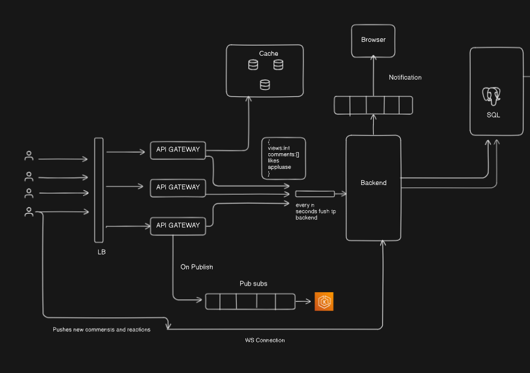

# Database Architecture for a Social Platform

Okay, I understand. You want a README-style explanation for this system design diagram, as if it were the top-level README for a project.

Here's a README.md content based on the provided image:

-----

# Real-Time Interactive Platform - System Design

This repository contains the high-level system design for a real-time interactive platform, capable of handling high volumes of user engagement such as views, comments, likes, and applause. The design focuses on scalability, responsiveness, and data durability.

## Table of Contents

1.  [Introduction](#1-introduction)
2.  [Core Components](#2-core-components)
3.  [Data Flow & Interactions](#3-data-flow--interactions)
4.  [Design Principles & Benefits](#4-design-principles--benefits)
5.  [Future Considerations](#5-future-considerations)

-----

## 1\. Introduction

This document outlines the architectural blueprint for a platform designed to deliver a highly interactive user experience. It supports real-time updates for user actions like commenting and reacting, while efficiently managing high-volume, continuous interactions (e.g., views, likes) without overwhelming the persistent storage layer.

## 2\. Core Components

The system is composed of several key components, each serving a distinct purpose:

  * **Users:** The end-users interacting with the platform.
  * **Load Balancer (LB):** Distributes incoming traffic across multiple API Gateway instances, ensuring high availability and efficient resource utilization.
  * **API Gateway:** Acts as the single entry point for all client requests. It handles initial routing, authentication, and potentially rate limiting before forwarding requests to the appropriate downstream services. Multiple instances provide scalability and redundancy.
  * **Cache:** An in-memory data store for quickly accumulating and serving high-frequency, real-time interaction metrics (e.g., `views`, `comments` list, `likes`, `applause`). It reduces the load on the backend and database for these ephemeral updates.
  * **Backend:** The core application logic layer. It processes business rules, orchestrates data interactions, handles real-time updates, and manages persistence.
  * **SQL Database:** The primary persistent data store for all critical and structured application data (e.g., content, users, comments). Ensures data integrity and reliability.
  * **Browser:** The user interface clients that consume and interact with the platform.
  * **Notification Queue:** A message queue used by the Backend to push notifications to the Browser clients. It decouples the notification sending process and helps manage notification bursts.
  * **Pub/Sub System:** A publish-subscribe messaging service (Redis )used for asynchronous communication, specifically for events like "On Publish" (e.g., new content being published). This allows the Backend to react to such events without tight coupling.
  * **WS Connection (WebSocket Connection):** A persistent, bi-directional communication channel between the Browser and the Backend. Essential for pushing real-time updates (like new comments/reactions) to clients and receiving real-time inputs from clients.

## 3\. Data Flow & Interactions

The system handles various types of interactions with specific optimized flows:

### 3.1. High-Frequency Interactions (Views, Likes, Applause)

1.  User actions (e.g., a view, a like) are sent through the **Load Balancer** to an **API Gateway**.
2.  The **API Gateway** directs these actions to the **Cache**, where counts and relevant details are quickly updated in memory.
3.  Periodically (e.g., "every N seconds"), the **Cache** flushes these aggregated updates to the **Backend**.
4.  The **Backend** then persists these summarized interactions into the **SQL Database**.
    *This approach minimizes direct database writes for every single minor interaction, enhancing performance.*

### 3.2. Content Publication

1.  When new content is "On Publish" (likely via an internal tool or user action through an API Gateway), an event is sent to the **Pub/Sub System**.
2.  The **Backend** subscribes to these "On Publish" events.
3.  Upon receiving an event, the **Backend** processes the new content and stores it in the **SQL Database**.

### 3.3. Real-Time Comments and Reactions

1.  When a user submits a new comment or reaction from their **Browser**, it's sent via the **Redis pub subs** to the **Backend**.
2.  The **Backend** processes this input, saves it to the **SQL Database**, and updates relevant data in the **Cache**.

## 4\. Design Principles & Benefits

  * **Scalability:** Achieved through the use of Load Balancers, multiple API Gateways, and the ability to horizontally scale the Backend and Cache.
  * **Real-time Responsiveness:** WebSockets enable instant push notifications for critical updates like new comments, providing a dynamic user experience.
  * **Efficiency for High-Volume Data:** The Cache layer offloads the database for frequent, small updates, significantly reducing read and write latency for interaction counts.
  * **Asynchronous Processing:** The Pub/Sub system and Notification Queue decouple services, improving system resilience and allowing for smoother handling of traffic spikes.
  * **Data Durability:** The SQL Database ensures that all critical application data is reliably stored and consistent.

-----